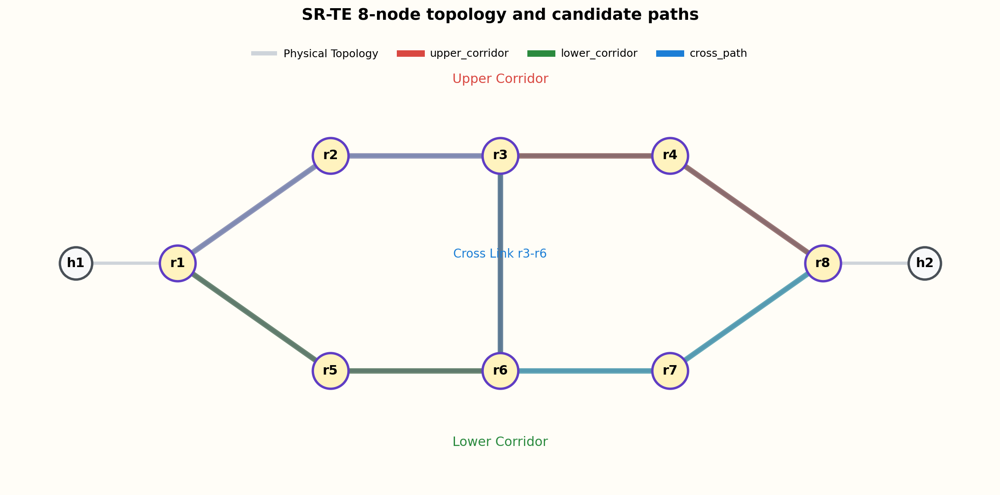

# SR-TE ML Lab

An end-to-end Segment Routing Traffic Engineering (SR-TE) lab built with `containerlab`, `FRR`, `iperf3`, and Python-based machine learning.

The project implements a closed-loop workflow:
- collect network telemetry and probe RTT data,
- generate mixed elephant/mice traffic,
- train a short-horizon congestion predictor,
- score SR-TE candidate paths offline,
- validate that path choices react consistently to injected congestion.

The current version uses an **8-router topology** with two corridor paths and one middle cross-link.
The recommended workflow in this repository is now explicitly centered on a **60-second prediction horizon**.

## Overview

This repository is designed for experiments around ML-assisted SR-TE path selection.

At a high level, the workflow is:
1. Deploy the 8-node topology with `containerlab` and `FRR`.
2. Generate mixed traffic using `traffic_gen_v2.sh`.
3. Collect interface counters, RTT, and controller state using `collector.py`.
4. Build a dataset and train a future-MLU predictor with `ML.py`.
5. Run `srte_decider.py` to score candidate paths.
6. Validate decision quality using replay analysis and controlled congestion tests.

## Topology

Current topology name:
- `srte8`

Physical layout:



Logical corridors from `r1` to `r8`:
- Upper corridor: `r1 -> r2 -> r3 -> r4 -> r8`
- Lower corridor: `r1 -> r5 -> r6 -> r7 -> r8`
- Cross-link path: `r1 -> r2 -> r3 -> r6 -> r7 -> r8`
- Reverse cross-link path: `r1 -> r5 -> r6 -> r3 -> r4 -> r8`

Host addressing:
- `h1 = 192.168.1.2/24`, gateway `192.168.1.1`
- `h2 = 192.168.8.2/24`, gateway `192.168.8.1`

Candidate path definitions live in:
- [candidate_paths_example.json](/home/hp/srte-project/diamond/candidate_paths_example.json)

## Repository Layout

```text
.
├── lab.clab.yml                     # containerlab topology definition
├── r1/ ... r8/                      # FRR configs for all routers
├── collector.py                     # telemetry, RTT probes, control overhead collection
├── traffic_gen_v2.sh                # mixed elephant/mice traffic generator
├── ML.py                            # dataset build, training, evaluation, plots
├── srte_decider.py                  # offline SR-TE path scorer / chooser
├── candidate_paths_example.json     # 4 candidate path definitions
├── controller_state_*.json          # state templates for igp/static/ml_dynamic
├── data/                            # experiment datasets, models, plots, decisions
└── scripts/
    ├── run_experiment.sh            # one-command experiment runner
    ├── check_connectivity.sh        # topology and OSPF health checks
    ├── check_paths.sh               # path-level reachability checks
    ├── check_experiment_data.py     # validate collected runs
    ├── summarize_experiment_results.py # summarize igp/static/ml_dynamic baselines
    ├── build_topk_dataset.py        # build Top-K elephant datasets
    ├── build_dataset_only.py        # build dataset_full.csv without training
    ├── analyze_path_choices.py      # replay decider decisions over a dataset
    ├── validate_decider_output.py   # logical consistency checker for decisions
    ├── apply_decision.py            # apply chosen path as FRR static-route actions
    ├── plot_topology.py             # draw topology and selected path
    └── force_upper_congestion_test.sh # reusable congestion-injection validation
```

## Requirements

Minimum environment:
- Linux
- Docker
- containerlab
- Python 3.9+
- `iperf3`

Python packages used by the project:
- `numpy`
- `pandas`
- `scikit-learn`
- `matplotlib`
- `joblib`
- optional: `xgboost`

Notes:
- Most scripts assume `sudo docker` by default.
- You can override Docker invocation with `DOCKER_CMD=docker` if your environment does not require `sudo`.

## Step 1: Deploy the Topology

```bash
sudo containerlab deploy -t lab.clab.yml
```

Basic connectivity check:

```bash
bash scripts/check_connectivity.sh
```

Path-level check:

```bash
bash scripts/check_paths.sh
```

These checks validate:
- expected containers are running,
- OSPF adjacencies are up,
- point-to-point links are reachable,
- end-to-end host connectivity is working.

## Step 2: Collect Data

You can collect data in two ways.

### Option A: One-command experiment runner

Run one full collection round for one mode:

```bash
bash scripts/run_experiment.sh igp run1
bash scripts/run_experiment.sh static run1
bash scripts/run_experiment.sh ml run1
```

Recommended first:
- `igp`
- `static`
- `ml`

Recommended duration for a formal run:
- `TOTAL_DURATION=1800` (30 minutes)

Example smoke test:

```bash
TOTAL_DURATION=600 SEED=101 bash scripts/run_experiment.sh igp smoke
```

### Option B: Manual collector + traffic generator

Collector example:

```bash
python3 collector.py \
  --targets \
    clab-srte8-r1:eth1,eth2 \
    clab-srte8-r2:eth1,eth2 \
    clab-srte8-r3:eth1,eth2,eth3 \
    clab-srte8-r4:eth1,eth2 \
    clab-srte8-r5:eth1,eth2 \
    clab-srte8-r6:eth1,eth2,eth3 \
    clab-srte8-r7:eth1,eth2 \
    clab-srte8-r8:eth1,eth2 \
  --capacities \
    clab-srte8-r1:eth1=1000 clab-srte8-r1:eth2=1000 \
    clab-srte8-r2:eth1=1000 clab-srte8-r2:eth2=1000 \
    clab-srte8-r3:eth1=1000 clab-srte8-r3:eth2=1000 clab-srte8-r3:eth3=1000 \
    clab-srte8-r4:eth1=1000 clab-srte8-r4:eth2=1000 \
    clab-srte8-r5:eth1=1000 clab-srte8-r5:eth2=1000 \
    clab-srte8-r6:eth1=1000 clab-srte8-r6:eth2=1000 clab-srte8-r6:eth3=1000 \
    clab-srte8-r7:eth1=1000 clab-srte8-r7:eth2=1000 \
    clab-srte8-r8:eth1=1000 clab-srte8-r8:eth2=1000 \
  --interval 1 \
  --duration 600 \
  --outdir data \
  --experiment-id exp_manual \
  --mode ml_dynamic \
  --traffic-profile medium \
  --state-file data/controller_state.json \
  --probes \
    clab-srte8-h1:192.168.8.2:h1_to_h2 \
    clab-srte8-h2:192.168.1.2:h2_to_h1
```

Traffic generator example:

```bash
TOTAL_DURATION=600 \
TRAFFIC_PROFILE=medium \
FLOW_PROTO=tcp \
LOG_DIR=data \
TOPK_WINDOW_SECS=60 \
TOPK_K=5 \
bash traffic_gen_v2.sh
```

## Collected Data Products

Main outputs written to `data/`:

Telemetry and probes:
- `telemetry_long_*.csv`
- `telemetry_wide_*.csv`
- `probe_rtt_*.csv`
- `control_overhead_*.csv`

Traffic and flow logs:
- `traffic_events_*.csv`
- `traffic_flow_intervals_*.csv`
- `traffic_manifest_*.json`
- `iperf_json_*/`
- `state_snapshots_*/`

Top-K elephant datasets:
- `topk_elephants_*.csv`
- `topk_elephant_windows_*.csv`

Use this validator after collection:

```bash
python3 scripts/check_experiment_data.py --data-dir data
```

## Step 3: Train the ML Model

Train the recommended 60-second future MLU predictor:

```bash
python3 ML.py \
  --data-dir data \
  --output-dir data/ml_results \
  --target-col network_mlu_pct \
  --horizons 60 \
  --model auto
```

Recommended baseline for this project:
- use `60s` as the main and only reporting horizon,
- because the current dataset is strongest and most stable at `60s`,
- and this keeps the project aligned around one clear experimental story.

Main outputs:
- `dataset_full.csv`
- `dataset_runs.json`
- `model_network_mlu_pct_60s.joblib`
- `metrics.csv`
- `metrics_by_group.csv`
- `predictions_test.csv`
- multiple plots (`mae_by_mode`, `r2_by_mode`, timeseries, residuals, scatter plots)

Interpretation of the model in this project:
- the model predicts **future network state**, not a path ID directly;
- the main target is future `network_mlu_pct`;
- `srte_decider.py` then uses this forecast to score candidate paths.

## Step 4: Run the Decider

Run the decider on the engineered dataset and trained model:

```bash
python3 srte_decider.py \
  --dataset data/ml_results/dataset_full.csv \
  --model data/ml_results/model_network_mlu_pct_60s.joblib \
  --paths-json candidate_paths_example.json \
  --state-file data/controller_state.json \
  --lab lab.clab.yml \
  --out-json data/ml_results/decision_latest.json
```

Main fields in the decision JSON:
- `current_candidate_path_id`
- `current_candidate_inference_basis`
- `predicted_future_mlu_pct`
- `decision_reason`
- `chosen_candidate_path_id`
- `candidate_scores`
- `scoring_basis`

The current decider uses:
- physical-link-aware scoring (`physical_edges`) when possible,
- threshold gating,
- switch penalties,
- path hot-link penalties,
- observed-load inference to determine the currently carried corridor more realistically.

## Step 5: Visualize the Selected Path

Generate a topology image with the selected path highlighted:

```bash
python3 scripts/plot_topology.py \
  --lab lab.clab.yml \
  --paths-json candidate_paths_example.json \
  --decision-json data/ml_results/decision_latest.json \
  --output data/ml_results/topology_decision_latest.png
```

You can also highlight a path manually:

```bash
python3 scripts/plot_topology.py \
  --lab lab.clab.yml \
  --paths-json candidate_paths_example.json \
  --highlight-path cross_path \
  --output data/topology_cross.png
```

## Step 6: Apply the Decision to the Running Lab

This repository currently realizes the selected SR-TE corridor as hop-by-hop
FRR static routes rather than native MPLS/SRv6 policy programming.

Preview the generated router actions first:

```bash
python3 scripts/apply_decision.py \
  --decision-json data/ml_results/decision_latest.json \
  --paths-json candidate_paths_example.json \
  --lab lab.clab.yml \
  --dry-run
```

Apply the chosen path to the running lab:

```bash
python3 scripts/apply_decision.py \
  --decision-json data/ml_results/decision_latest.json \
  --paths-json candidate_paths_example.json \
  --lab lab.clab.yml
```

The script:
- reads `chosen_candidate_path_id`,
- converts the path into per-hop next hops,
- removes previously managed static routes for the destination prefix,
- installs new FRR static routes for `192.168.8.0/24`,
- optionally installs reverse routes for `192.168.1.0/24`.

## Live Apply and Route Validation

After applying a decision, verify that the selected corridor is really active in
the live FRR route tables.

### Example A: Apply the latest decider result

```bash
python3 scripts/apply_decision.py \
  --decision-json data/ml_results/decision_latest.json \
  --paths-json candidate_paths_example.json \
  --lab lab.clab.yml \
  --out-json data/ml_results/apply_decision_live.json
```

### Example B: Force the lower corridor for a reverse validation test

```bash
python3 scripts/apply_decision.py \
  --path-id lower_corridor \
  --paths-json candidate_paths_example.json \
  --lab lab.clab.yml \
  --out-json data/ml_results/apply_decision_lower_live.json
```

### Verify the active route in FRR

Check the destination prefixes on all routers:

```bash
for c in r1 r2 r3 r4 r5 r6 r7 r8; do
  echo "=== $c ==="
  sudo docker exec clab-srte8-$c vtysh \
    -c 'show ip route 192.168.8.0/24' \
    -c 'show ip route 192.168.1.0/24'
done
```

How to interpret the output:
- if `upper_corridor` is active, the best static path to `192.168.8.0/24` should follow:
  - `r1 -> 10.0.12.2`
  - `r2 -> 10.0.23.2`
  - `r3 -> 10.0.34.2`
  - `r4 -> 10.0.48.2`
- if `lower_corridor` is active, the best static path to `192.168.8.0/24` should follow:
  - `r1 -> 10.0.15.2`
  - `r5 -> 10.0.56.2`
  - `r6 -> 10.0.67.2`
  - `r7 -> 10.0.78.2`

Reverse validation for `192.168.1.0/24` should mirror the selected corridor from
`r8` back toward `r1`.

### Optional host-side check

```bash
sudo docker exec clab-srte8-h1 ip route get 192.168.8.2
sudo docker exec clab-srte8-h2 ip route get 192.168.1.2
```

Note:
- host-side checks only confirm the local default gateway hop,
- the decisive proof of corridor selection is the per-router FRR route table.

## Step 7: Replay and Analyze Path Choices

Replay the decider over a whole dataset and count chosen paths:

```bash
python3 scripts/analyze_path_choices.py \
  --dataset data/ml_results/dataset_full.csv \
  --model data/ml_results/model_network_mlu_pct_60s.joblib \
  --paths-json candidate_paths_example.json \
  --state-file data/controller_state.json \
  --lab lab.clab.yml \
  --output-dir data/path_choice_analysis \
  --sample-step 60
```

Outputs:
- `path_choice_replay.csv`
- `path_choice_counts.csv`
- `path_choice_reasons.csv`
- `path_choice_counts.png`
- `path_choice_reasons.png`

This is useful to show that the decider is not simply returning one path all the time.

## Step 8: Summarize Baseline Results

To compare `igp`, `static`, and `ml_dynamic` in one place, run:

```bash
python3 scripts/summarize_experiment_results.py \
  --data-dir data \
  --ml-output-dir data/ml_results \
  --output-dir data/experiment_summary
```

Outputs:
- `baseline_run_summary.csv`
- `baseline_mode_summary.csv`
- `ml_metrics_overall.csv`
- `ml_metrics_by_mode.csv`
- `baseline_mlu_max_by_mode.png`
- `baseline_rtt_p99_by_mode.png`
- `baseline_loss_by_mode.png`
- `baseline_path_changes_by_mode.png`

This script is the recommended way to produce a concise baseline comparison for:
- maximum link utilization,
- probe RTT,
- loss,
- path-change overhead,
- and ML performance by mode.

## Step 9: Validate a Decision

Validate that a decider output is logically self-consistent:

```bash
python3 scripts/validate_decider_output.py \
  --decision-json data/ml_results/decision_latest.json \
  --strict
```

This checks whether:
- the chosen path exists in `candidate_scores`,
- the `decision_reason` matches the selected path,
- the chosen score and recorded score match,
- the result is internally consistent.

## Step 10: Congestion Injection Experiments

The repository includes a reusable congestion-injection script:

- [scripts/force_upper_congestion_test.sh](/home/hp/srte-project/diamond/scripts/force_upper_congestion_test.sh)

Despite the historical name, it now supports shaping arbitrary interface sets.

### Example: Upper-corridor congestion

```bash
MODE_NAME=ml_dynamic \
OUTDIR=/tmp/upper_congestion_test \
MODEL_PATH=data/ml_results/model_network_mlu_pct_60s.joblib \
bash scripts/force_upper_congestion_test.sh
```

Default shaped interfaces for this script are the upper corridor:
- `r1:eth1`
- `r2:eth2`
- `r3:eth2`
- `r4:eth2`

### Example: Lower-corridor congestion

```bash
MODE_NAME=ml_dynamic \
OUTDIR=/tmp/lower_congestion_test \
SHAPE_IFACES_CSV="clab-srte8-r1:eth2,clab-srte8-r5:eth2,clab-srte8-r6:eth2,clab-srte8-r7:eth2" \
MODEL_PATH=data/ml_results/model_network_mlu_pct_60s.joblib \
bash scripts/force_upper_congestion_test.sh
```

What the script does:
1. backs up and switches `controller_state.json` to the chosen mode,
2. applies `tc tbf` shaping to the selected interfaces,
3. collects a short telemetry run,
4. builds a dataset,
5. picks the latest run's peak-congestion timestamp,
6. runs `srte_decider.py` on that peak snapshot,
7. writes a decision JSON and highlighted topology PNG.

### What we validated so far

Using controlled congestion injection, we verified:
- when the **upper corridor** is shaped, the decider consistently moves away from it and prefers `lower_corridor`;
- when the **lower corridor** is shaped, the decider consistently moves away from it and prefers `upper_corridor`.

This provides strong evidence that path selection is not random and reacts directionally to congestion placement.

## Controller State Templates

The repository includes templates for the three experiment modes:
- [controller_state_igp.json](/home/hp/srte-project/diamond/controller_state_igp.json)
- [controller_state_static.json](/home/hp/srte-project/diamond/controller_state_static.json)
- [controller_state_ml.json](/home/hp/srte-project/diamond/controller_state_ml.json)

You can switch manually with:

```bash
cp controller_state_igp.json data/controller_state.json
cp controller_state_static.json data/controller_state.json
cp controller_state_ml.json data/controller_state.json
```

## Candidate Path File Format

Path definitions follow this format:

```json
{
  "upper_corridor": {
    "interfaces": [
      "clab-srte8-r1:eth1",
      "clab-srte8-r2:eth2",
      "clab-srte8-r3:eth2",
      "clab-srte8-r4:eth2"
    ],
    "segment_list": "",
    "description": "Top corridor from r1 to r8 via r2-r3-r4"
  }
}
```

The current candidate set includes four paths:
- `upper_corridor`
- `lower_corridor`
- `cross_path`
- `cross_path_reverse`

## Recommended End-to-End Workflow

For a full experiment cycle:

1. Deploy topology
```bash
sudo containerlab deploy -t lab.clab.yml
```

2. Verify topology
```bash
bash scripts/check_connectivity.sh
bash scripts/check_paths.sh
```

3. Collect three baseline runs
```bash
bash scripts/run_experiment.sh igp run1
bash scripts/run_experiment.sh static run1
bash scripts/run_experiment.sh ml run1
```

4. Validate collected data
```bash
python3 scripts/check_experiment_data.py --data-dir data
```

5. Train the 60-second ML model
```bash
python3 ML.py --data-dir data --output-dir data/ml_results --target-col network_mlu_pct --horizons 60 --model auto
```

6. Run the decider
```bash
python3 srte_decider.py --dataset data/ml_results/dataset_full.csv --model data/ml_results/model_network_mlu_pct_60s.joblib --paths-json candidate_paths_example.json --state-file data/controller_state.json --lab lab.clab.yml --out-json data/ml_results/decision_latest.json
```

7. Apply the decision to the lab
```bash
python3 scripts/apply_decision.py --decision-json data/ml_results/decision_latest.json --paths-json candidate_paths_example.json --lab lab.clab.yml --dry-run
```

8. Validate the active route in the live lab
```bash
for c in r1 r2 r3 r4 r5 r6 r7 r8; do
  echo "=== $c ==="
  sudo docker exec clab-srte8-$c vtysh -c 'show ip route 192.168.8.0/24' -c 'show ip route 192.168.1.0/24'
done
```

9. Summarize baseline results
```bash
python3 scripts/summarize_experiment_results.py --data-dir data --ml-output-dir data/ml_results --output-dir data/experiment_summary
```

10. Validate the decision and plot it
```bash
python3 scripts/validate_decider_output.py --decision-json data/ml_results/decision_latest.json --strict
python3 scripts/plot_topology.py --lab lab.clab.yml --paths-json candidate_paths_example.json --decision-json data/ml_results/decision_latest.json --output data/ml_results/topology_decision_latest.png
```

11. Replay choices over the dataset
```bash
python3 scripts/analyze_path_choices.py --dataset data/ml_results/dataset_full.csv --model data/ml_results/model_network_mlu_pct_60s.joblib --paths-json candidate_paths_example.json --state-file data/controller_state.json --lab lab.clab.yml --output-dir data/path_choice_analysis --sample-step 60
```

12. Run controlled congestion validation
```bash
bash scripts/force_upper_congestion_test.sh
```

## Cleanup

Destroy the lab:

```bash
sudo containerlab destroy -t lab.clab.yml
```

## Notes

Current project status:
- the ML predictor is intentionally standardized on the `60s` horizon,
- the decider is offline, not a fully online FRR controller,
- physical-edge scoring and observed-load inference are already implemented,
- congestion injection experiments show consistent corridor-level reactions.

This makes the repository suitable for:
- course project demonstrations,
- ML-assisted TE experiments,
- controlled validation of SR-TE path-choice logic.
